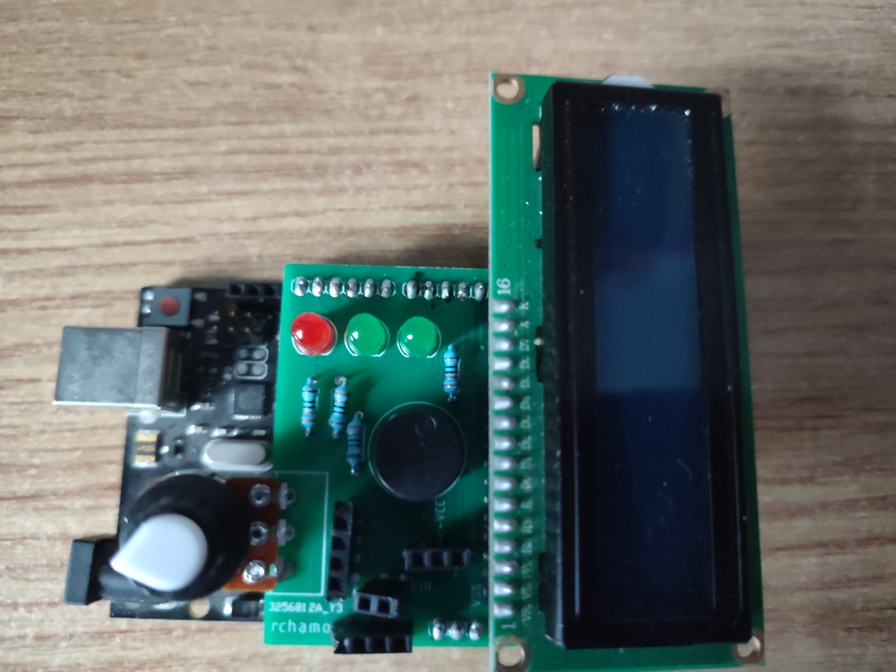
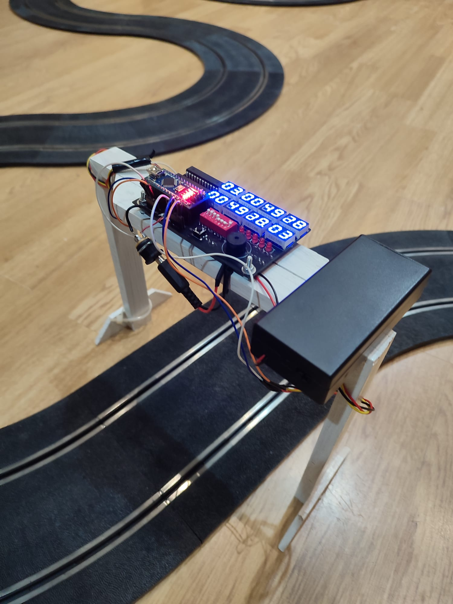
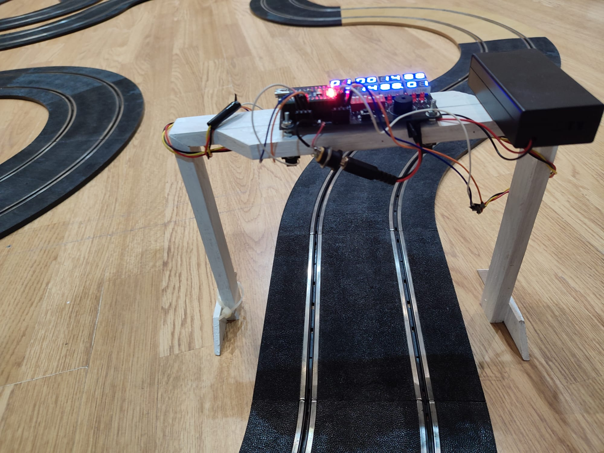
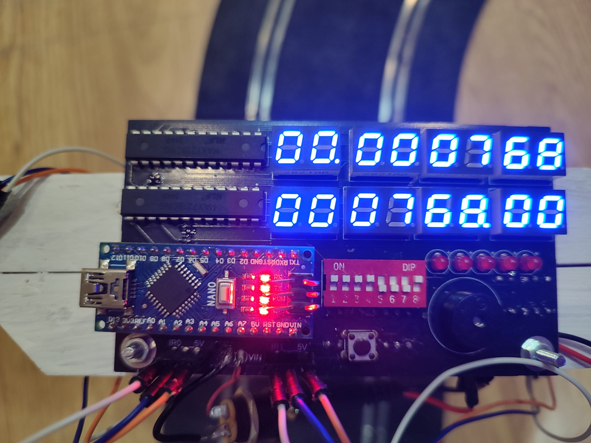
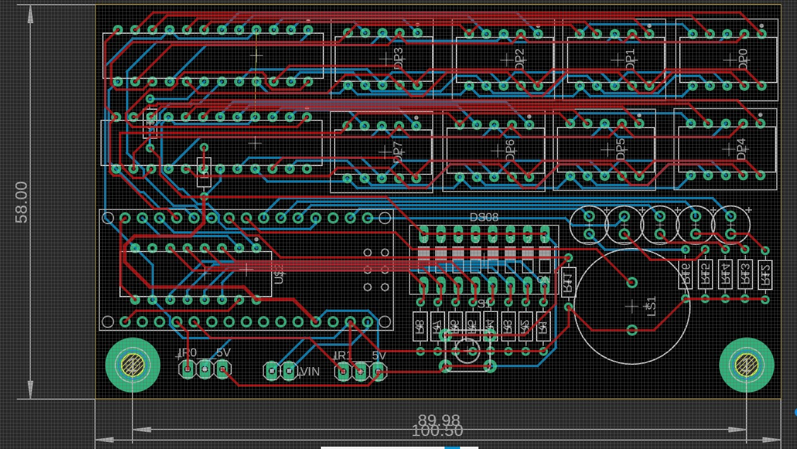
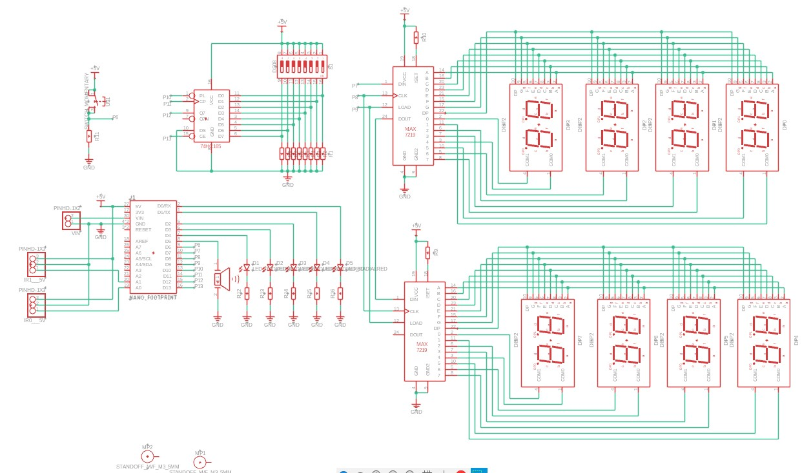

# Crear un cuentavueltas con una placa Arduino

# Cuentavueltas version beta.

Para las carreras realizadas en el club era necesario contar las vueltas y los tiempos. En los primeros campeonatos esto se hacía de forma manual con un simple cronometro, pero esto resultaba ineficiente y poco preciso, dando muchos problemas.	
Actualmente, el club cuenta con un [semáforo digital de la marca Carrera](https://www.amazon.es/Carrera-electr%C3%B3nico-compatible-Evolution-sistemas/dp/B0002FQJ4Y/ref=sr_1_1?__mk_es_ES=%C3%85M%C3%85%C5%BD%C3%95%C3%91&nsdOptOutParam=true&s=toys&sr=1-1&ufe=INHOUSE_INSTALLMENTS%3AES_IHI_4M_AUTOMATED). Este semáforo permite contar vueltas y tiempos además de dar la salida.

Pero antes de que el club pudiera comprarse un semáforo, se las tuvo que ingeniar para crear un cuentavueltas casero que tuviera las mismas funcionalidades que uno comercial. Por ello, CHAMO DESIGN inventó un semáforo fundamentado en Arduino y con [sensores de infrarrojo](https://www.amazon.es/ARCELI-GP2Y0A21YK0F-Distancia-anal%C3%B3gico-Compatible/dp/B07MY27W7T/ref=sr_1_1?nsdOptOutParam=true&sr=8-1) para la detección de movimiento.

Los materiales utilizados para este semáforo fueron:
+ Arduino UNO.
+	Sensores SHARP infrarrojos.
+	Pantalla LCD.
+	Marco de madera.
+	Leds.
+	Resistencias varias.
+	Batería 9V (opcional).
+	Potenciómetro (opcional).
+	Controlador infrarrojo (opcional).
+	Zumbador (opcional).
+	PCB (opcional).

Los materiales marcados como opcional no serían necesarios para el proyecto pudiendo cambiarlos por otros o simplemente no usarlos.

Los sensores basados en luz infrarrojos permiten medir distancias sin muchas interferencias entre ellos. El funcionamiento de estos sensores se basa en medir la distancia constantemente. El sistema cuenta esta distancia como un 0 y cuando la distancia cambia, pasando un coche por el sensor, es un 1. Este funcionamiento de lógica digital y flancos de subida es muy útil para el caso del semáforo. Con la utilización de la detección de flancos de subida, se evitan que el semáforo cuente más de una vuelta.

El semáforo cuenta con una [pantalla LCD](https://www.amazon.es/AZDelivery-HD44780-Pantalla-caracteres-incluido/dp/B08216WMDJ/ref=sr_1_7?__mk_es_ES=%C3%85M%C3%85%C5%BD%C3%95%C3%91&nsdOptOutParam=true&sr=8-7) para visualizar los tiempos y las vueltas realizadas de forma clara. Se podría visualizar usando otros métodos como una pantalla TFT pero con la pantalla LCD se cumplen las funcionalidades básicas.

Los Leds servirán para marcar la salida de los coches o marcar otros eventos como la realización de una vuelta o la finalización de la carrera. Serán necesarias añadir unas resistencias de 330 Ω para que no se quemen los leds.

Para alimentar el semáforo se puede usar una batería de 9V conectada a la placa Arduino. También se puede usar una toma de corriente que transforme los 220V en alterna de la red a los 9-12V en continua que necesita el Arduino.

El potenciómetro está incluido para calibrar la distancia que miden los sensores, el controlador de infrarrojos se añadió para controlar el sistema del semáforo de forma remoto y el zumbador también sirve para señalizar las vueltas.

Por último, se diseñó una PCB para evitar el exceso de cables y la simplicidad en el montaje. Se puede sustituir por una protoboard y pines, pero tendría una apariencia más descuidada.

Todo el código utilizado en este semáforo se puede encontrar en el [repositorio de CHAMO DESIGN](https://github.com/rchamo01/Arduino/tree/20a4224506cea3e5a7ccc267e2628bf88cf54640/cuentavueltas4). En un principio se programó el semáforo para que se establecieran cada piloto y estableciera los enfrentamientos entre estos. Esto sería complicar demasiado el diseño, por eso, es mejor reducir las características del semáforo a las más básicas.

Durante las pruebas del semáforo, este media con bastante exactitud las vueltas y tiempos de los coches. La interfaz que se utilizo fue demasiado complicada pudiendo reducirse en diseño, eliminando elementos innecesarios como el controlador o el zumbador y reduciendo líneas de código considerablemente.

# Cuentavueltas versión definitiva.

Después de la versión Beta, CHAMO DESIGN decidió que se podía mejorar el cuentavueltas. Para ello, cambiarían como se visualizaba el cronometro y se mejoraría el diseño electrónico.

Para ello, primero se cambió la pantalla LCD que tiene sus ventajas, como la fácil programación y electrónica sencilla, pero se visualiza peor, por unos display de 7 segmentos azules. Estos ofrecerán mejor visualización de los tiempos y las vueltas realizadas. 

En segundo lugar, se cambió el microcontrolador. Se sustituyó el Arduino Uno por un Arduino Nano, más pequeño, permitiendo integrarlo sobre el marco de madera.

Otro cambio importante es la botonería. Para introducir el número de vueltas o el tiempo, se usa un array de botones. El funcionamiento puede ser complicado de entender puesto que se tienen que poner el número en binario, dejando el ultimo bit para indicar si se quiere jugar en modo cuentavueltas o cuenta tiempos. De esta forma, si se quieren dar 1o vueltas, se tendrá que poner el bit 10100001.

Hay otro botón individual para iniciar la partida o visualizar la vuelta rápida. 

También tiene un zumbador que indica la salida y el paso de cada vuelta.

Se han usado los mismos sensores que en la versión beta puesto que han demostrado funcionar bien. Además, hay un semáforo con leds para la salida.

Por último, se ha diseñado una PCB que mejora la electrónica. Se ha usado Fusion 360 para el diseño de la PCB. El esquema y conexiones son las siguientes:

Lista de componentes:
+ Arduino Nano.
+ x2 sensores SHARP infrarrojos.
+ x8 displays de 7 segmentos con dos digitos.
+ x2 max7219 para controlar los displays
+ array de botones
+ 74HC165
+ x5 leds rojos
+ Zumbador
+ Botón
+ Resistencias
+ Bateria
+ PCB

El código se puede encontrar en [repositorio de CHAMO DESIGN](https://github.com/rchamo01/Arduino/tree/main/cuentavueltas2_05). Se optó por un diseño mucho más simple con solo dos posibilidades, contar vueltas o contar tiempos.

Este cuentavueltas se usó por primera vez en la competicion de [rally dakar de 2025](https://rchamo01.github.io/SlotCasaRaton/prensa/05eventodakarabril2025) demostrando funcionar al mismo nivel que un cuentavueltas comercial.
