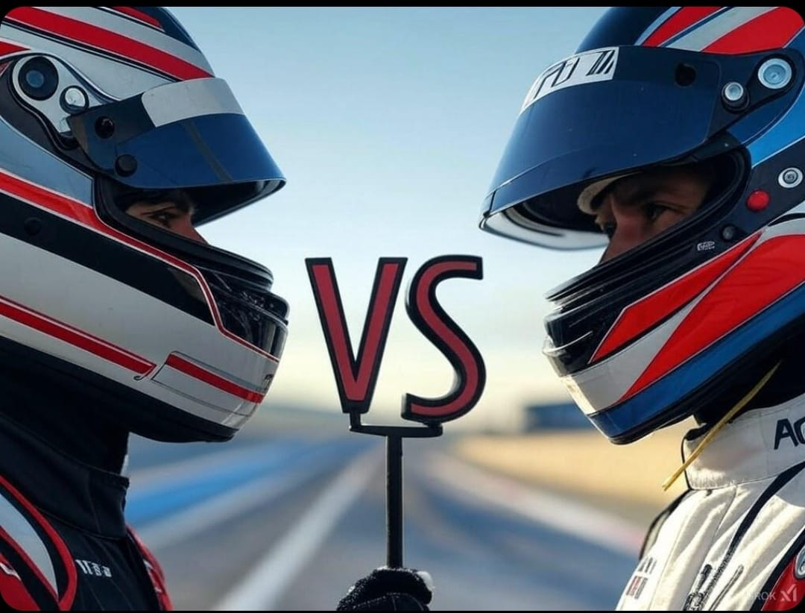

# Código para los enfrentamientos

  Para controlar los enfrentamientos que se realizan en cada competición, CHAMO DESIGN creó un programa que calcula automáticamente el ganador. Además, el programa cuenta con una interfaz agradable.

	En el programa, hay que introducir cada participante, con su respectivo vehículo. Una vez se completa este campo, el programa pasa a modo enfrentamientos donde se rellenan los tiempos y las vueltas de cada piloto. En el caso de que se repitan los enfrentamientos por algún error, el programa podrá detectar este error y dar un correspondiente mensaje informativo.

	El sistema también permite visualizar en cada momento la clasificación. Cuando se termine la competición, proporcionará una tabla con los tiempos y vueltas totales, proporcionando también al vencedor del campeonato.

	Este programa, realizado en el lenguaje de programación Python, se puede encontrar en el siguiente repositorio [(codigo)](https://github.com/rchamo01/control_scalextric/blob/9e8072c6ec99532988b6dd865ec7aa7ea6a69e32/scalextric_final.py).

	Por último, mencionar que este programa se puede implementar en una Raspberry pi, que junto a una pantalla TFT, permitirá visualizarlo en el club sin necesidad de un ordenador con pantalla. Esto hace más portable el proyecto, siendo necesario solo una toma de electricidad.

 

