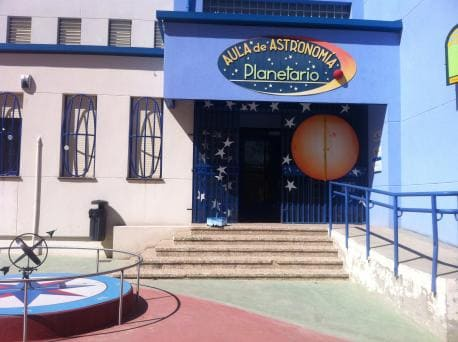
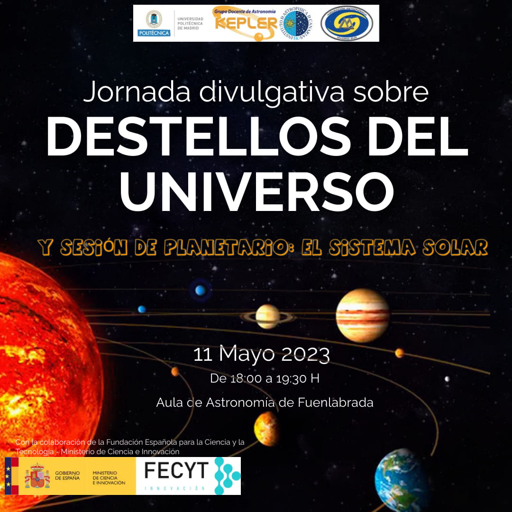

¿Qué son las Perseidas, también conocidas como "Lágrimas de San Lorenzo"? ¿Cómo se producen las lluvias de estrellas? ¿Qué es una cámara de todo el cielo? ¿Qué es la Ciencia Ciudadana? En esta actividad divulgativa del proyecto Destellos del Universo, se dará respuesta a estas y otras cuestiones.

Es una actividad orientada a niños y niñas de 3º de primaria a la que puede asistir la familia completa.
 
La fecha de la actividad es el **11 de mayo de 2023 (jueves) en horario de 18:00h a 19:30h, en el Aula de Astronomía de Fuenlabrada** (Calle Callao, nº 61, Fuenlabrada). La actividad consta de dos partes:

- **Charla divulgativa (45 minutos)**. Raquel Cedazo, profesora de la Universidad Politécnica de Madrid y responsable del proyecto Destellos del Universo, junto a Ángel Pérez Navarro, miembro del Grupo Docente de Astronomía Kepler y de la Asociación para la enseñanza de la Astronomía, hablarán sobre lluvias de estrellas y ciencia ciudadana. Una sesión muy dinámica en la que se hará interactuar al público.

- **Sesión planetaria (45 minutos)**. Docentes del Aula de Astronomía de Fuenlabrada explicarán a las familias el Sistema Solar en su fantástico planetario.

La actividad es gratuita pero se requiere inscripción previa porque las plazas son limitadas debido a la capacidad del planetario.

El [Aula de Astronomía de Fuenlabrada](https://www.auladeastronomiadefuenlabrada.com/) es un recurso educativo público dedicado a la enseñanza de la astronomía en el ámbito escolar desde el curso 1998/1999. Surge de la colaboración de la Consejería de Educación de la Comunidad de Madrid con la Concejalía de Educación del  Ayuntamiento de Fuenlabrada y los docentes del Grupo Képler.

El proyecto Destellos del Universo fomenta la participación de la sociedad en iniciativas de ciencia ciudadana con el principal objetivo de **aumentar las vocaciones científicas de los jóvenes**.

