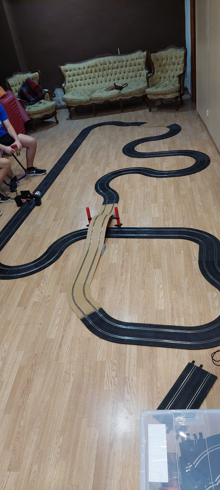
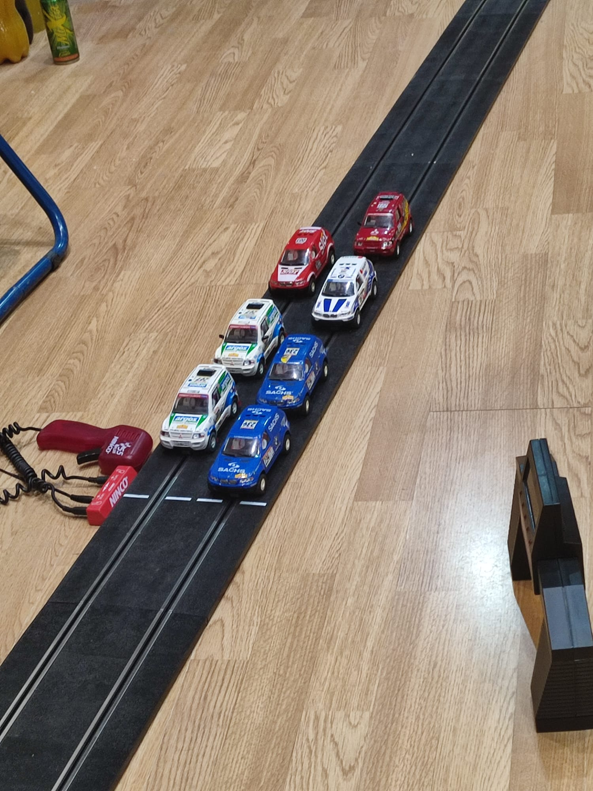

El evento que ha entusiasmado a los amantes del Scalextric y del rally. Se llevó a cabo una competición temática del Rally Dakar con un circuito que desafió a los competidores con dunas y curvas cerradas. La pista, diseñada para evocar los legendarios desiertos y paisajes del Dakar, ofreció una experiencia inolvidable para los participantes y espectadores.

La competición, celebrada en el club Casa Raton Scalextric, presentó una alineación diversa de vehículos, destacando entre ellos modelos Mitsubishi y BMW, conocidos por su participación histórica en el Rally Dakar real. Los coches Mitsubishi, con su legado en el rally, y los BMW, con su tecnología y diseño innovador, se enfrentaron en un duelo de destreza y resistencia.

El circuito fue un verdadero desafío, con sectores de dunas artificiales que simulaban la arena del desierto y curvas cerradas que exigían precisión y control por parte de los pilotos. Cada coche tuvo que demostrar su capacidad para superar estos obstáculos, manteniéndose en la pista y manteniendo la velocidad necesaria para competir por el primer lugar.

Tras una carrera reñida y llena de emoción, donde cada curva y cada duna probó la habilidad de los participantes, un BMW se alzó como el vencedor. El modelo de BMW, destacando por su manejo y adaptación al circuito, logró mantener un ritmo constante y seguro, superando a los Mitsubishi y otros competidores para cruzar la línea de meta en primer lugar.

Este evento no solo fue una celebración del hobby del Scalextric sino también un tributo a la emoción y la aventura del Rally Dakar, demostrando que incluso en miniatura, la pasión por la competencia y la innovación técnica pueden llevar a resultados emocionantes y sorprendentes. La comunidad de Scalextric ya espera con ansias la próxima edición, posiblemente con nuevos desafíos y modelos aún más sofisticados.
