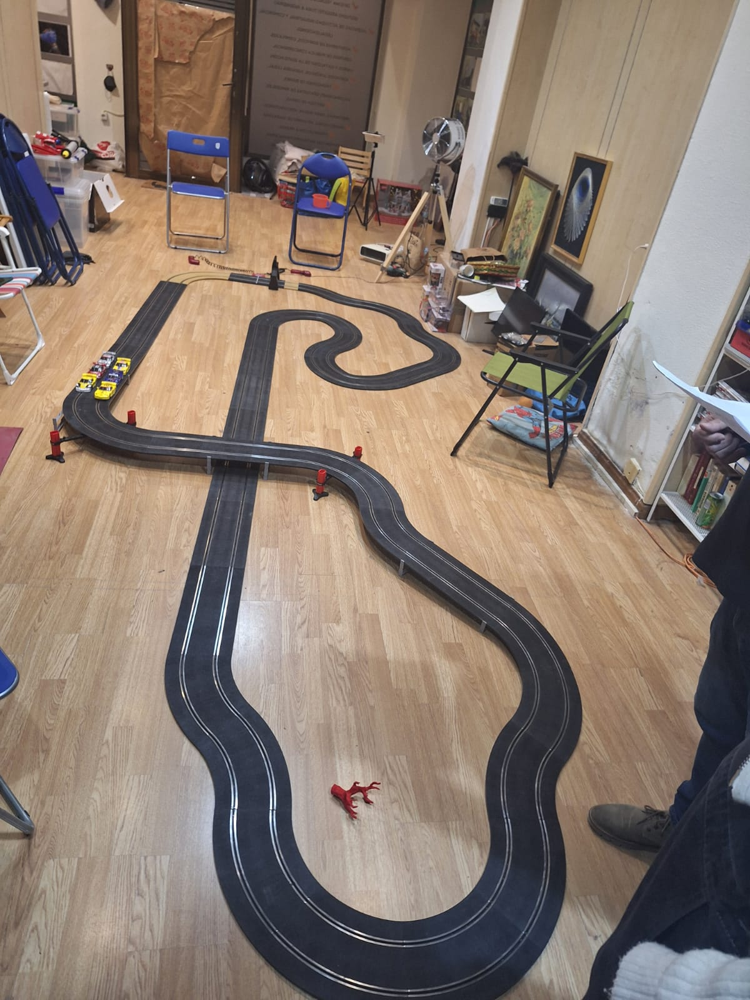

En una tarde cargada de emoción y adrenalina, se llevó a cabo una competición de Slot en el Club Slot Casa Ratón que capturó la atención de todos los entusiastas de este deporte. La modalidad era de resistencia, con carreras de 24 minutos donde el objetivo era acumular el máximo número de vueltas posibles. Todos los competidores manejaban modelos de Chevrolet Corvette, lo que añadía un desafío único al evento.

El diseño del circuito fue una verdadera prueba para los pilotos, con curvas cerradas que demandaban una precisión milimétrica. Un puente ingeniosamente colocado aseguraba que ambos carriles estuvieran equilibrados, brindando igualdad de condiciones para todos los participantes. Este diseño no solo puso a prueba la habilidad de los corredores, sino también la resistencia y adaptabilidad de los Corvette.

A pesar de la meticulosa planificación, muchos pilotos enfrentaron problemas de calendario que afectaron su rendimiento. Los compromisos laborales y personales forzaron a varios competidores a llegar tarde o a tener que abandonar la carrera antes de lo esperado, lo que añadió un elemento extra de incertidumbre y tensión al evento.

Sin embargo, el Corvette con el número 2 amarillo emergió como el indiscutible campeón. Bajo la pericia de su piloto, este coche no solo lideró la mayor parte de la carrera, sino que también abrumó a los comisarios de pista. La estrategia agresiva del piloto obligó a los comisarios a intervenir constantemente para recolocar los coches que se salían del trazado debido a las maniobras audaces. Este dominio del circuito y la habilidad para mantener un ritmo constante sin errores significativos fueron claves para su victoria. El piloto consiguió dar 151 vueltas en los 24 minutos proclamándose el campeón de la competición.

La celebración del Corvette número 2 no solo fue por la victoria en sí, sino también por haber superado los desafíos logísticos y de competencia que caracterizaron este evento. La competición demostró una vez más por qué el Scalextri sigue siendo un deporte de estrategia, habilidad y pasión, donde cada vuelta cuenta y cada segundo puede cambiar el destino de la carrera
