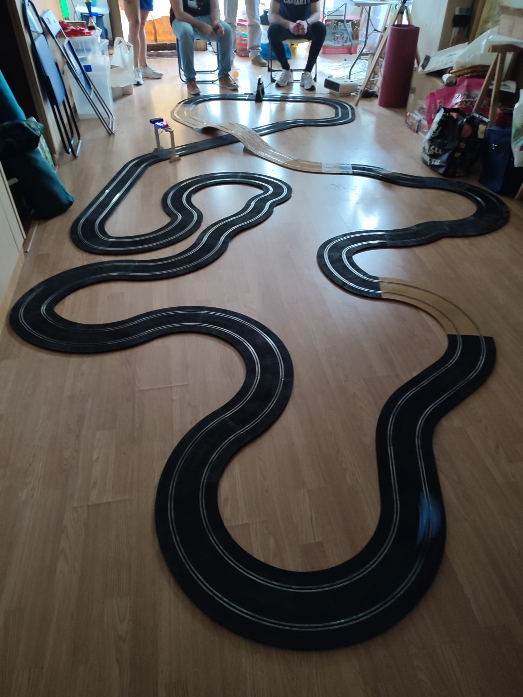
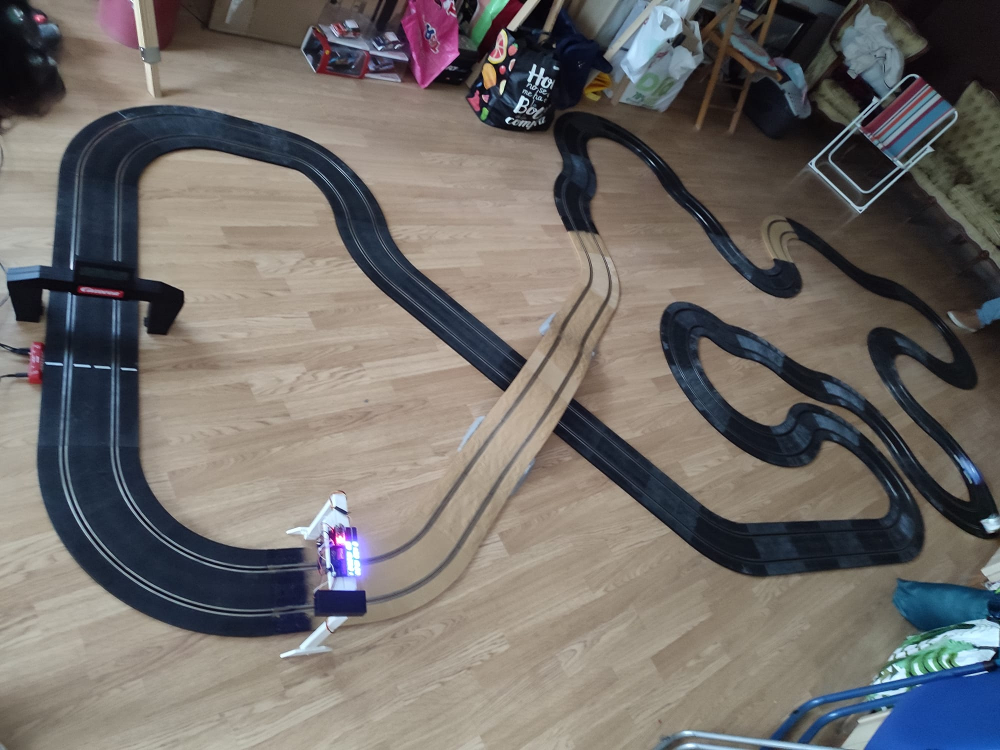
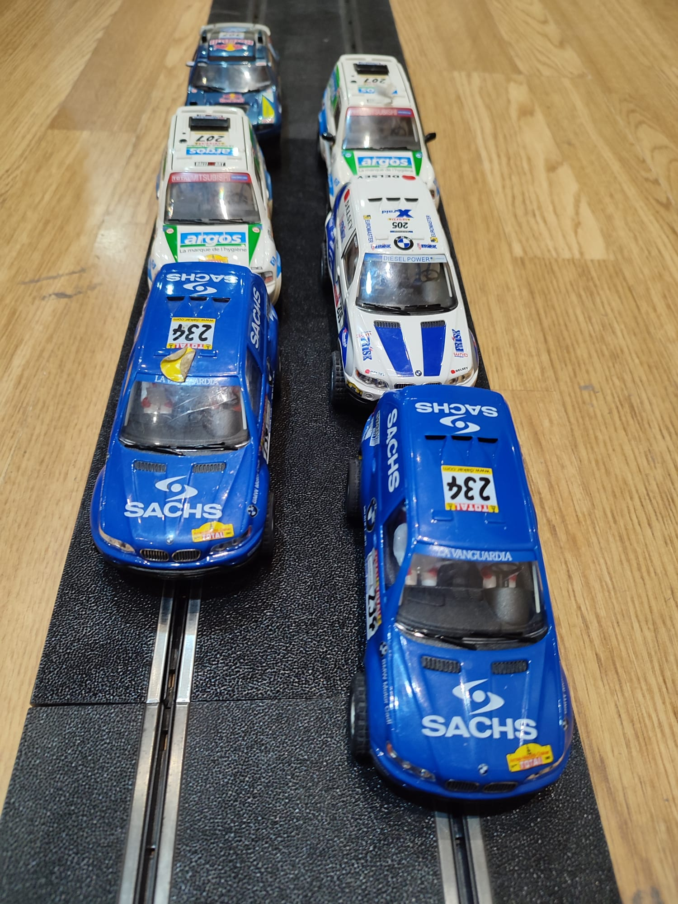
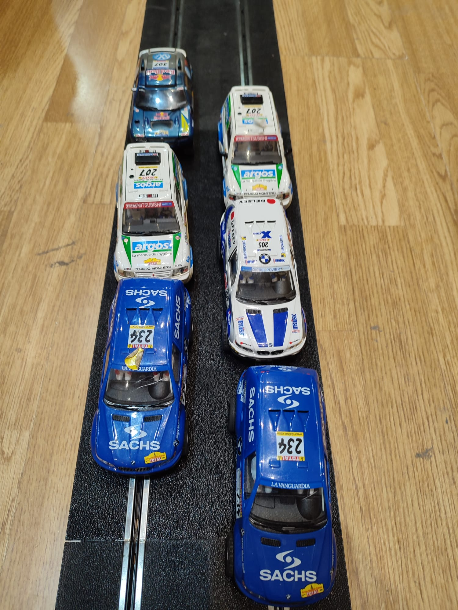

Los aficionados al Scalextric vivieron una jornada cargada de emoción en la competición de Rally Dakar, celebrada en un espectacular circuito que recreaba las duras condiciones del desierto. La categoría Raid reunió a seis potentes vehículos: un Volkswagen Touareg, tres BMW X5 y dos Mitsubishi Pajero, todos listos para enfrentarse a un trazado exigente con una imponente duna, múltiples curvas y una longitud que puso a prueba la habilidad de los pilotos.
El circuito, diseñado para simular la esencia del Dakar, incluyó un desafío único: si un coche se salía de la pista, el piloto debía colocarlo sin ayuda externa, emulando las duras condiciones del rally real. La carrera consistió en completar 60 vueltas en el menor tiempo posible, y la tensión se mantuvo hasta el último segundo.

Tras una batalla reñida, el BMW X5 azul de Jose se alzó con la victoria, completando las 60 vueltas en un tiempo récord de 14 minutos y 2 segundos. El piloto demostró un control magistral, sorteando la duna y las curvas con precisión, y gestionando con destreza las pocas salidas de pista. Los otros competidores no se lo pusieron fácil, con el Volkswagen Touareg y los Mitsubishi Pajero manteniendo un ritmo feroz, pero el BMW marcó la diferencia.

La emoción de los espectadores fue palpable, y la organización ya prepara la próxima edición, prometiendo aún más desafíos. ¡El Scalextric Rally Dakar sigue consolidándose como un evento imprescindible para los amantes de la velocidad y la estrategia!
