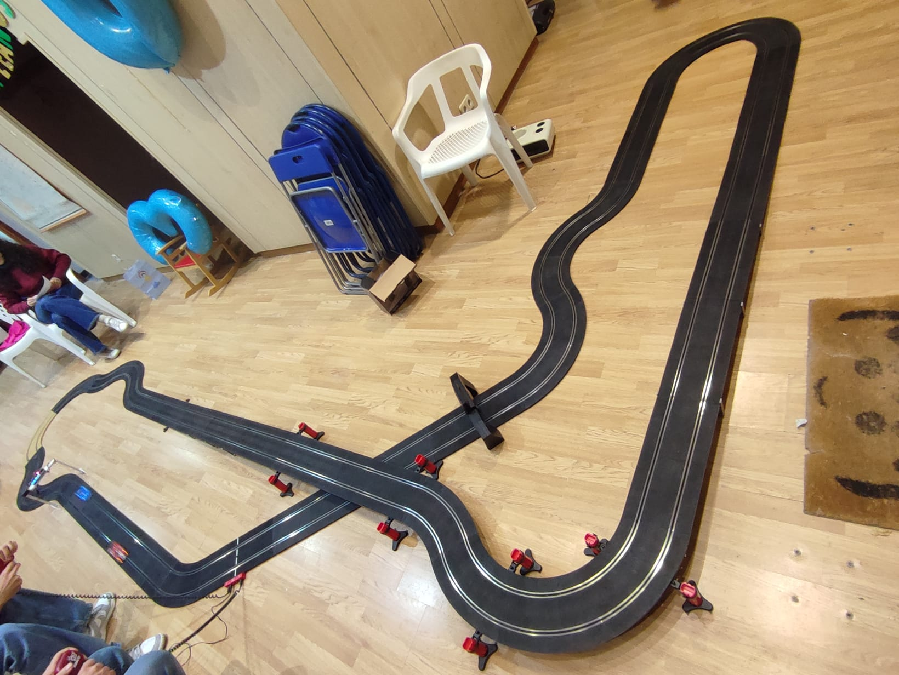
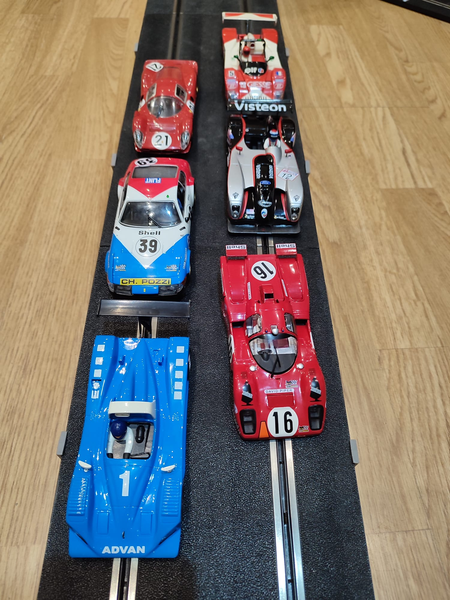

La adrenalina se apoderó del asfalto (o mejor dicho, de las pistas) durante la última edición del Gran Premio SlotCasaRatón con la modalidad de coches DTM, una competición vibrante en la que los pilotos demostraron destreza, reflejos y una pasión desbordante por la velocidad.

La categoría DTM (Deutsche Tourenwagen Masters) representa una de las disciplinas más emocionantes del automovilismo europeo, conocida por sus potentes turismos derivados de modelos de calle, pero ajustados al límite con tecnología de competición. En esta ocasión, todos los participantes compitieron con réplicas de Mercedes AMG C-Coupé o Audi RS 5 DTM, máquinas icónicas que combinaron diseño, potencia y precisión sobre el circuito de slot.

La carrera se desarrolló bajo el formato de liga, en la que cada piloto compitió contra todos sus rivales, rotando por los distintos carriles durante enfrentamientos de 2 minutos en cada uno. El objetivo: completar el mayor número de vueltas posibles en el tiempo límite.

El gran vencedor de la jornada fue el Mercedes rojo, pilotado por Raúl, logrando 89 vueltas e imponiendo un ritmo constante e implacable. A tan solo tres vueltas, el Mercedes naranja, pilotado por María, sorprendió a todos con una actuación sobresaliente: 86 vueltas y un lugar más que merecido en el podio, tras una conducción técnica y aguerrida.

Pese a algunas bajas notables debido a conflictos de agenda (presentados como "compromisos previos en otros grandes premios del calendario slot") el evento mantuvo un alto nivel competitivo. La pista se llenó de tensión, talento y estrategia.

La jornada dejó anécdotas para el recuerdo: algunos pilotos, al límite de sus reflejos, invadieron carriles contrarios en curvas complicadas, robando valiosa energía a sus adversarios y desatando reacciones en cadena que encendieron al público. Otros no lograron controlar del todo su vena competitiva, generando momentos de tensión que avivaron aún más el espíritu del evento.

Por si fuera poco, el tiempo fue un enemigo más, y algunos heats debieron correrse con velocidad récord para cumplir con la planificación, aumentando la presión y la emoción en cada salida.

En resumen el tercer Gran Premio SlotCasaRatón, modalidad DTM dejó claro que, aunque en miniatura, la pasión por el automovilismo se vive a lo grande.
