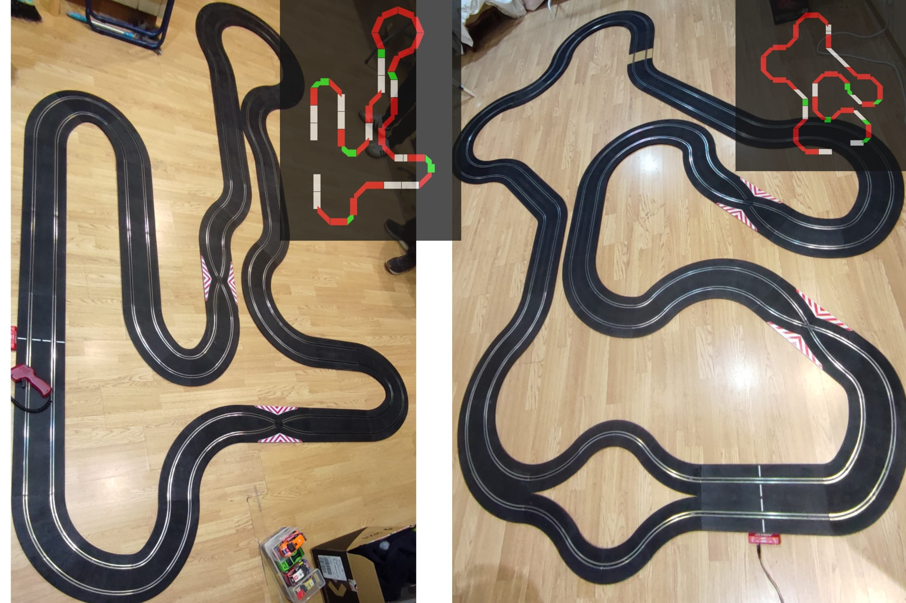
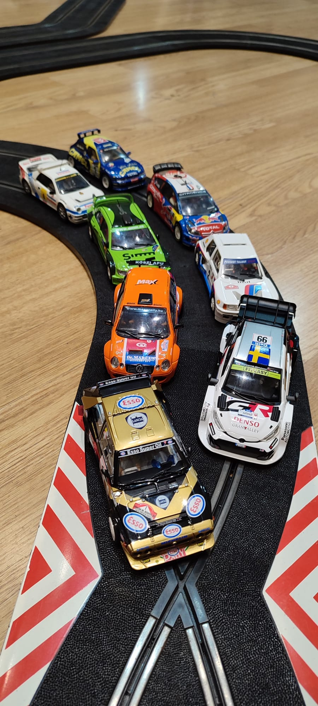

El *Club Slot Casa Ratón* dio el pistoletazo de salida a la temporada con un evento que no dejó indiferente a nadie. El primer gran premio del año llegó en forma de **rally**, una modalidad siempre exigente y espectacular, que volvió a demostrar por qué es una de las favoritas tanto para pilotos como para aficionados. La cita reunió a numerosos participantes y estuvo marcada por la variedad de vehículos, las novedades técnicas, los incidentes en pista y una intensa lucha contra el crono.

La carrera se disputó en modalidad por tiempos, sumando los resultados obtenidos en cuatro tramos cronometrados, repartidos en **dos circuitos distintos**, lo que obligó a los pilotos a adaptarse rápidamente a diferentes configuraciones, ritmos y niveles de dificultad. Cada tramo exigía máxima concentración, ya que cualquier error se pagaba caro en la clasificación general.

La parrilla fue un auténtico homenaje a la historia del rally, con modelos tan icónicos como el **Ford RS200**, el **Peugeot 205 Turbo 16**, el **Citroën C4**, el **Toyota Yaris WRC1**, el **Mitsubishi Lancer EVO SIMM**, el **Volkswagen Polo S1600**, el **Citroën ZX** y el siempre temido **Lancia Delta S4 Chrono**. Precisamente este último fue el gran protagonista de la jornada, ya que el piloto que lo conducía logró imponerse finalmente y alzarse con la victoria absoluta del rally, demostrando un control exquisito y una regularidad clave en todos los tramos.

Uno de los aspectos más comentados del evento fue el **estreno de nuevos cruces de pistas** en los circuitos. Estas incorporaciones añadieron un extra de dificultad y realismo, pero también provocaron más de una colisión inesperada, generando momentos de tensión, salidas de pista y algún que otro lamento entre los pilotos. Los cruces se convirtieron en puntos críticos donde se decidían segundos vitales y donde la pericia al volante marcaba la diferencia.

Como anécdota destacada, este primer evento del año contó con la incorporación de una nueva participante, **María GM**, fundadora del grupo *MaJos*. Su debut no pasó desapercibido y fue recibido con curiosidad y expectación por parte del resto de pilotos, aportando aire fresco al campeonato y demostrando que el club sigue creciendo y atrayendo nuevos talentos.

La jornada, sin embargo, no estuvo exenta de polémica. La tensión con los comisarios, algo que ya se ha convertido casi en tradición dentro del club, volvió a hacer acto de presencia. Decisiones discutidas, reclamaciones por salidas de pista y revisiones de tiempos generaron debates encendidos que añadieron aún más intensidad al ambiente competitivo.

A todo ello se sumó un problema técnico con la tensión eléctrica durante uno de los tramos. Varios pilotos comenzaron a notar una pérdida total de potencia en sus coches, quedándose literalmente parados en pista. Tras detectar la incidencia, la organización se vio obligada a detener y reanudar la carrera, garantizando la igualdad de condiciones para todos los participantes. Aunque el incidente generó nervios y retrasos, fue resuelto con rapidez y profesionalidad.

Por último, este gran premio sirvió como escenario para estrenar una nueva norma que marca un antes y un después en el club: **cada piloto debía competir con su propio mando**. Esta medida permitió ver auténticas joyas tecnológicas en acción, con mandos sofisticados y de alta gama, cuidadosamente ajustados y personalizados. Algunos pilotos aprovecharon la ocasión para lucir sus nuevas adquisiciones, generando comentarios, comparaciones y, cómo no, algo de sana envidia.

 

En definitiva, el rally de slot organizado por el *Club Slot Casa Ratón* fue un evento completo: competitivo, intenso y lleno de novedades. Una prueba que deja el listón muy alto para el resto de la temporada y confirma que el slot sigue vivo, evolucionando y ofreciendo grandes momentos tanto dentro como fuera de la pista.

