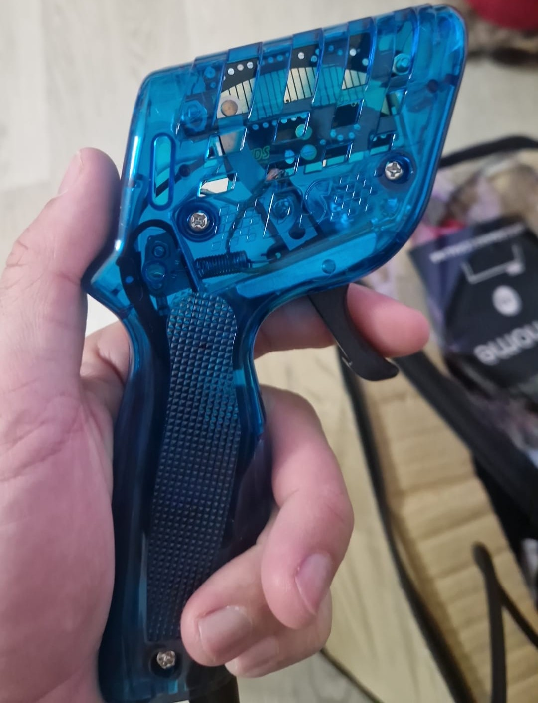

aaaaaaaaaaaaaaaaaaaaaaaaaa

En la categoría Grupo 5, la parrilla fue un auténtico desfile de leyendas. Compitieron modelos tan icónicos como el **Porsche 935 Gr5**, el **Ferrari 512 BB LM**, el **Capri Zakspeed Gr5**, el **BMW 320 Gr5**, el **BMW M1 Turbo Gr5** y el imponente **Ferrari 935/78 “Moby Dick”**. Desde las primeras mangas quedó claro que no habría concesiones: los coches eran rápidos, nerviosos y exigentes, y cualquier error se pagaba caro en un circuito diseñado para exprimir al máximo sus prestaciones.

La categoría Ferrari no se quedó atrás en emoción. En ella participaron el **Ferrari 550 Maranello** y el **Ferrari 360 GTC**, con varios coches iguales pero defendidos por equipos distintos, lo que añadió un interesante componente estratégico y comparativo. Aunque los modelos eran los mismos, las diferencias en reglajes, pilotaje y fiabilidad mecánica marcaron importantes distancias en pista.

Con la competición concluida, la tensión dio paso a la alegría. El club cerró la jornada con festejos, brindis y un convite colectivo, celebrando no solo al campeón, sino también el éxito de una temporada intensa y un Gran Premio final que quedará grabado en la memoria de todos los socios. SlotCasaRaton demostró, una vez más, que el slot es mucho más que un hobby: es pasión, rivalidad, compañerismo y celebración compartida.
