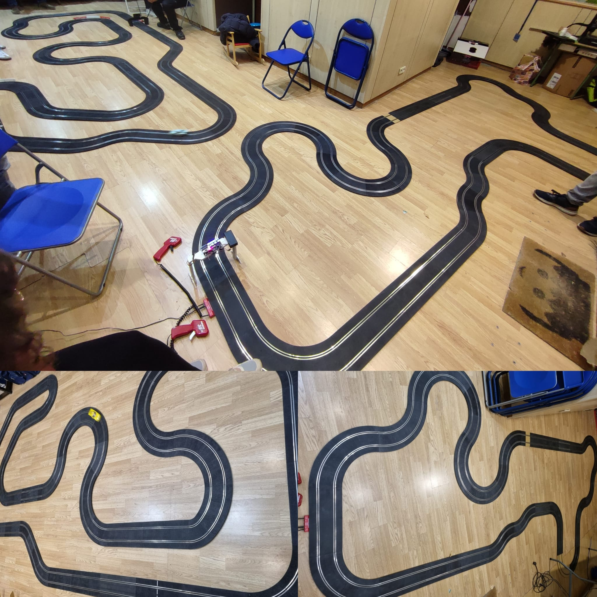
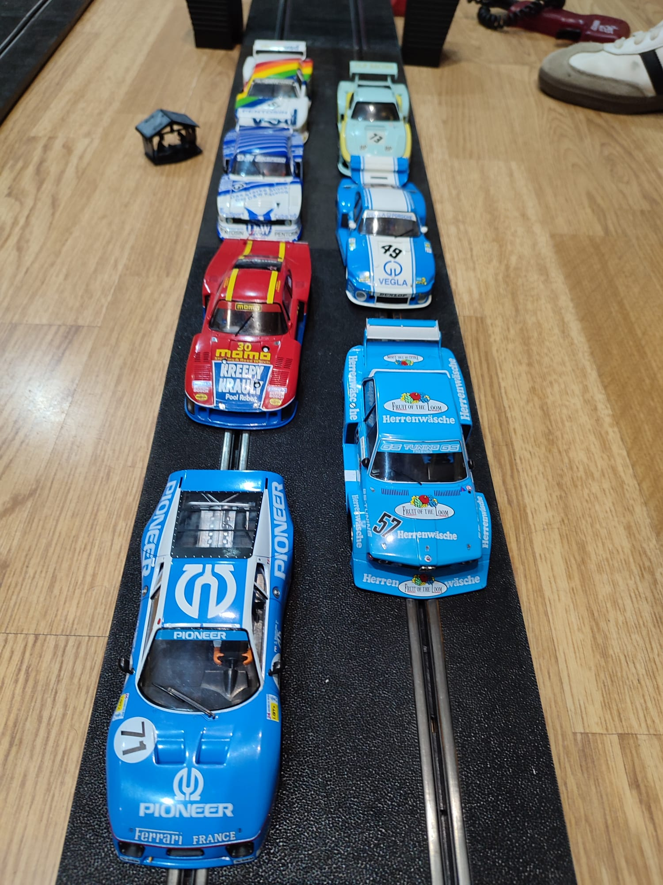
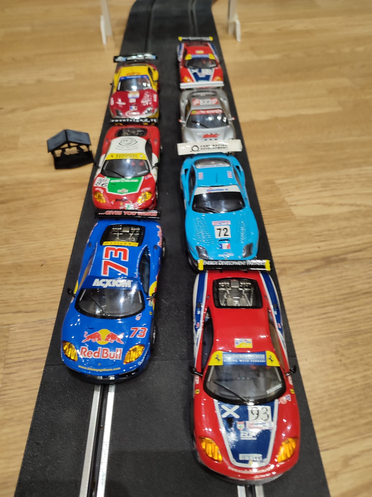

El club SlotCasaRaton vivió este diciembre de 2025 una de las jornadas más intensas y memorables de su historia con la disputa del **último Gran Premio de la temporada**, una cita decisiva que determinaba quién se proclamaría **campeón del club en 2025**. La expectación era máxima, y no era para menos: la competición se planteó en modalidad doble, con carreras tanto en **Grupo 5** como en **coches Ferrari**, una combinación que elevó el nivel de exigencia, la emoción… y también el caos.

Para esta ocasión tan especial, la organización apostó por un formato ambicioso: **dos circuitos** completamente distintos, uno diseñado específicamente para la brutalidad y velocidad del Grupo 5 y otro más técnico y preciso para los Ferrari. Los pilotos se vieron obligados a adaptarse rápidamente a trazados muy diferentes, poniendo a prueba su capacidad de lectura de pista, su finura al mando y su temple en los momentos decisivos.

En la categoría Grupo 5, la parrilla fue un auténtico desfile de leyendas. Compitieron modelos tan icónicos como el **Porsche 935 Gr5**, el **Ferrari 512 BB LM**, el **Capri Zakspeed Gr5**, el **BMW 320 Gr5**, el **BMW M1 Turbo Gr5** y el imponente **Ferrari 935/78 “Moby Dick”**. Desde las primeras mangas quedó claro que no habría concesiones: los coches eran rápidos, nerviosos y exigentes, y cualquier error se pagaba caro en un circuito diseñado para exprimir al máximo sus prestaciones.

La categoría Ferrari no se quedó atrás en emoción. En ella participaron el **Ferrari 550 Maranello** y el **Ferrari 360 GTC**, con varios coches iguales pero defendidos por equipos distintos, lo que añadió un interesante componente estratégico y comparativo. Aunque los modelos eran los mismos, las diferencias en reglajes, pilotaje y fiabilidad mecánica marcaron importantes distancias en pista.

La tensión fue creciendo a medida que avanzaba la jornada. El campeonato estaba en juego y los nervios se notaban tanto en el ambiente como en el pilotaje. La lucha por la victoria alcanzó tal nivel de intensidad que incluso se produjeron **amenazas verbales** —en tono serio pero cargado de adrenalina— hacia los comisarios, exigiéndoles máxima atención en las salidas de pista y en cualquier posible incidencia que pudiera alterar el resultado. Cada milésima contaba, y nadie quería perder el título por un detalle mal observado.

A esta presión se sumaron los problemas mecánicos, que aparecieron en el peor momento posible. Varios coches sufrieron fallos justo antes o durante las mangas decisivas, provocando un auténtico baile de destornilladores, revisiones de última hora y ajustes contrarreloj en el parque cerrado. Estas incidencias retrasaron el desarrollo del evento y añadieron aún más incertidumbre a una jornada ya de por sí caótica. La modalidad doble, con cambios constantes de circuito y categoría, terminó de generar un ambiente de ligero desorden, aunque siempre dentro del espíritu competitivo y pasional que caracteriza a SlotCasaRaton.

Finalmente, tras horas de carreras, ajustes, discusiones técnicas y tensión acumulada, llegó el desenlace. **El piloto Raúl** con el Ferrari 512 BB LM se alzó con la victoria del Gran Premio, un triunfo clave que le permitió proclamarse campeón del club SlotCasaRaton en 2025. Su regularidad, sangre fría y capacidad para adaptarse a ambos circuitos fueron determinantes para imponerse en una de las temporadas más disputadas que se recuerdan en el club.

Con la competición concluida, la tensión dio paso a la alegría. El club cerró la jornada con festejos, brindis y un convite colectivo, celebrando no solo al campeón, sino también el éxito de una temporada intensa y un Gran Premio final que quedará grabado en la memoria de todos los socios. SlotCasaRaton demostró, una vez más, que el slot es mucho más que un hobby: es pasión, rivalidad, compañerismo y celebración compartida.
