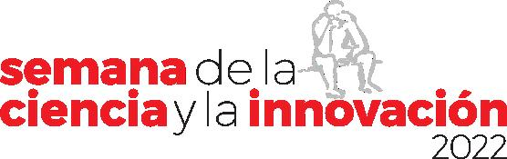
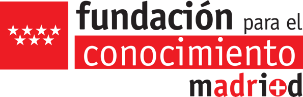

***Con la colaboración de la [Fundación Española para la Ciencia y la Tecnología](https://www.fecyt.es/) - [Ministerio de Ciencia e Innovación](https://www.ciencia.gob.es/)***

El próximo día 17 de noviembre participaremos en la **XXII Semana de la Ciencia** dentro del programa de visitas guiadas y talleres que organiza la ETS Ingeniería y Diseño Industrial (ETSIDI – UPM), bajo el título de la actividad:

**¿Podemos ayudar a los científicos? Conoce qué es la ciencia ciudadana a través del proyecto Destellos del Universo**

La profesora e investigadora principal del proyecto Destellos del Universo, Raquel Cedazo, junto con Ángel Pérez Navarro, miembro de la Agrupación Astronómica Madrid Sur y del Grupo Kepler, explicarán el objetivo científico de Destellos del Universo.
Los asistentes experimentarán cómo participar en este proyecto de ciencia ciudadana.
Os esperamos a todos el próximo jueves 17 de noviembre, no olvidéis inscribiros a través de la siguiente página de la ETSIDI 😄.

[Enlace a la noticia e inscripción en la web de la ETSIDI.](https://www.upm.es//Investigacion/innovacion/OTRI/UnidadCulturaCientifica/SemanaCiencia/Articulos?fmt=detail&prefmt=articulo&id=4e5c61d76dc62810VgnVCM10000009c7648a____)

[Enlace a la noticia en la web de la UPM – Unidad de Cultura Científica.](https://www.upm.es/Investigacion/innovacion/OTRI/UnidadCulturaCientifica/SemanaCiencia?id=d6e4ca44da852810VgnVCM10000009c7648a____&fmt=detail&prefmt=articulo)
