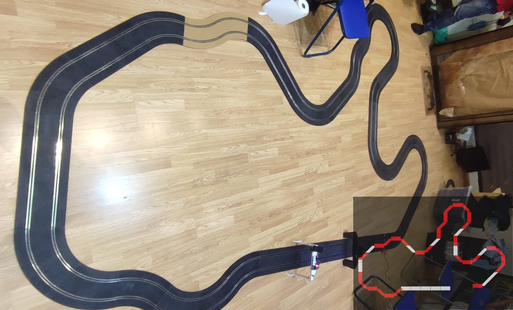
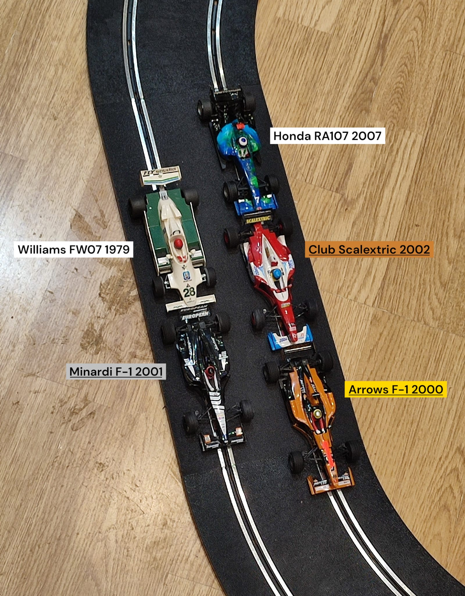

El club Slot Casa Ratón celebró recientemente una peculiar y entretenida competición de slot en categoría Fórmula 1, marcada tanto por la creatividad del circuito como por diversas anécdotas que no dejaron indiferente a nadie.

El evento tuvo lugar en un trazado inspirado en el histórico circuito del Jarama. Aunque los organizadores intentaron replicarlo con la mayor fidelidad posible, el resultado final presentó notables diferencias, lo que llevó a rebautizarlo con humor como el “Jaramilla”. Este nuevo circuito ofreció un desafío técnico considerable para los participantes, combinando zonas rápidas con curvas más exigentes.

La competición se desarrolló en formato de liga, enfrentando a todos los pilotos entre sí. Cada duelo consistía en tandas de 12 vueltas por carril, registrando los tiempos de cada participante. El vencedor final fue aquel que acumuló el menor tiempo total, premiando así la regularidad y precisión más que la velocidad punta.

En cuanto a los modelos participantes, la parrilla estuvo compuesta por:

* Williams FW07
* Club Scalextric 2002
* Honda RA107
* Arrows F1 2000
* Minardi F1 2001

Finalmente, fue el Arrows F1 2000 quien se alzó con la victoria, demostrando una gran consistencia a lo largo de toda la competición.

La jornada, sin embargo, no estuvo exenta de incidencias. Se registraron numerosas ausencias, lo que redujo la participación prevista. Además, algunos pilotos acudieron sin la camiseta reglamentaria, requisito obligatorio del evento, lo que generó cierto malestar entre la organización.

Entre las anécdotas más destacadas, el piloto del Honda RA107 sufrió constantes problemas con la quilla de su coche, afectando notablemente su rendimiento. Por otro lado, se recordó de forma curiosa que el modelo Williams FW07 original contó en su día con un patrocinador tan polémico como inusual, lo que generó comentarios entre los asistentes.

Uno de los momentos más problemáticos se produjo durante el enfrentamiento entre el piloto del Minardi F1 2001 y la piloto del Club Scalextric 2002, cuando ambos coches bloquearon el cuentavueltas, obligando a repetir la manga. Este incidente añadió tensión a una competición ya de por sí ajustada.

El Club Scalextric 2002 también fue protagonista por una peculiaridad técnica: solo podía ser recolocado en pista por un comisario específico, lo que ralentizó algunas fases de la carrera y añadió un componente estratégico inesperado.

Finalmente, en un ambiente distendido, pilotos y comisarios hicieron una pausa para merendar donuts, reforzando el carácter social y cercano del evento.

En definitiva, una competición marcada por el humor, los contratiempos y la pasión por el slot, que dejó claro que, incluso lejos de la perfección del Jarama, el “Jaramilla” tiene ya su propio encanto.

