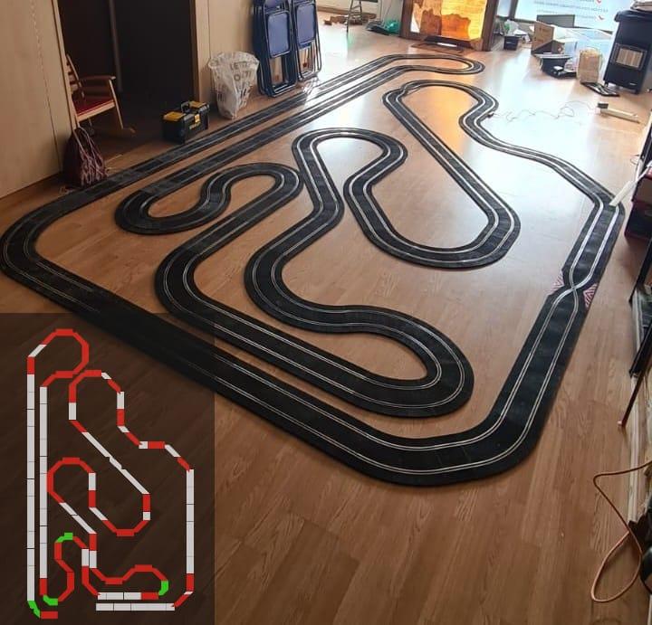

El pasado fin de semana, las instalaciones del **Club Slot Casa Ratón** se convirtieron en el epicentro de la velocidad en miniatura con la celebración de una jornada de exhibición que quedará grabada en la memoria de los socios. Bajo el formato de **carrera no puntuable**, los pilotos se reunieron con un único objetivo: domar al "Ribering", el circuito más ambicioso y extenso jamás montado por el club.

La gran estrella del evento fue, sin duda, el trazado. Bautizado como **"Ribering"**, este circuito excepcionalmente largo desafió la concentración de los asistentes con un recorrido superior a los **30 metros por vuelta**. La exigencia técnica del diseño obligó a los pilotos a mantener la tensión durante aproximadamente **20 segundos por giro**, lo que arroja una velocidad media de 1,5 m/s; una cifra que, a escala 1:32, se traduce en una sensación de velocidad de infarto en las rectas y una gestión quirúrgica de los frenos en las curvas cerradas.

A pesar de que el campeonato no sumaba puntos para la clasificación general, el ADN competitivo de Casa Ratón salió a relucir desde el primer gatillazo. Lo que comenzó como un entrenamiento derivó rápidamente en **intensos piques y enfrentamientos directos** en pista.

La competición se dividió en dos de las categorías más queridas por los aficionados al slot:
* **Corvette C5R:** Fuerza bruta y estabilidad en el paso por curva.
* **Ferrari 360 GTC:** Agilidad italiana para los sectores más revirados del Ribering.

Tras una jornada de mangas vibrantes, el podio reflejó la maestría sobre el mando. **Mario se coronó campeón** indiscutible, exhibiendo un pilotaje excepcional que rozó la perfección en cada sector. La plata fue para **Jose Manuel**, quien mantuvo la presión hasta el último segundo, mientras que **Manuel** cerró el podio con una meritoria tercera posición tras remontar en una final de infarto.

Más allá del ruido de los motores eléctricos y el olor a neumáticos, la jornada dejó una anécdota para la historia del club. En un momento de calma tras las finales, uno de los pilotos aprovechó el ambiente de camaradería para **anunciar sus próximas nupcias**. La noticia fue recibida con una ovación y la lógica sorpresa del resto de competidores, quienes cambiaron por un momento los mandos por abrazos para felicitar al futuro novio.

Sin duda, el Ribering no solo sirvió para entrenar el dedo, sino para reafirmar que en el Club Slot Casa Ratón, la pasión por las carreras y la amistad siempre van de la mano.
