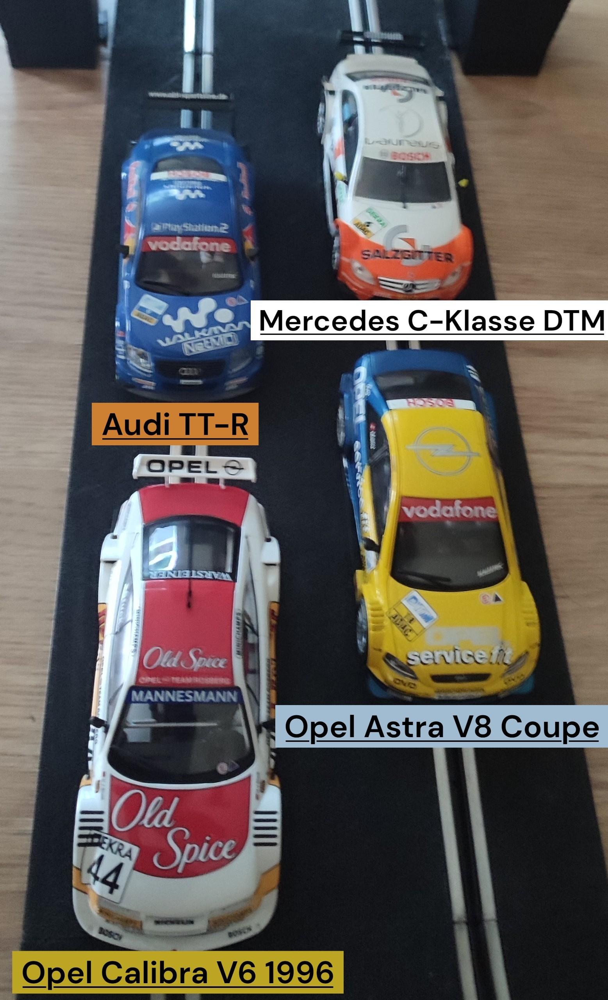
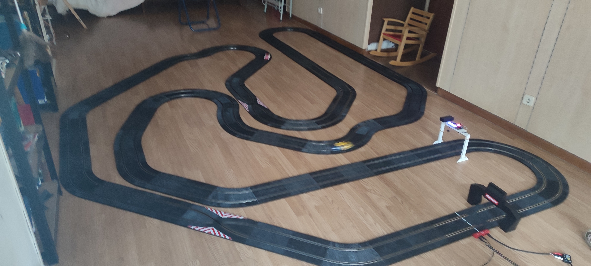

El **Club Slot Casa Ratón** celebró una nueva jornada de competición con una intensa liguilla en la modalidad DTM, en la que todos los participantes se enfrentaron entre sí en busca del mejor tiempo acumulado. El formato consistió en duelos a 12 vueltas por ambos carriles, sumando los registros obtenidos en cada enfrentamiento para establecer la clasificación final.

Los pilotos pusieron a prueba algunos de los modelos más representativos del campeonato alemán de turismos: el  **Mercedes C-Klasse DTM** pilotado originariamente por R. Schumacher de Scalextric, **Opel Calibra V6** de 1996 de Slot.it, el **Audi TT-R** de Scalextric y el **Opel Astra V8 Coupé**, también de Scalextric.

Uno de los grandes protagonistas de la jornada fue el circuito, diseñado para ofrecer carreras muy igualadas. Su largo trazado, con la misma distancia en ambos carriles y varios cruces que obligaban a extremar la concentración, añadió emoción y tensión a cada enfrentamiento, premiando tanto la velocidad como la regularidad.

La cita estuvo marcada además por las altas temperaturas propias del verano, que exigieron un esfuerzo extra a los pilotos durante toda la competición. A pesar del intenso calor, el ambiente fue excelente y la igualdad en pista se mantuvo hasta el final.

La jornada también contó con numerosas ausencias debido a lo apretado del calendario, aunque los asistentes disfrutaron de una competición repleta de emoción, adelantamientos y duelos muy disputados que volvieron a demostrar el alto nivel de las pruebas organizadas por el Club Slot Casa Ratón.

