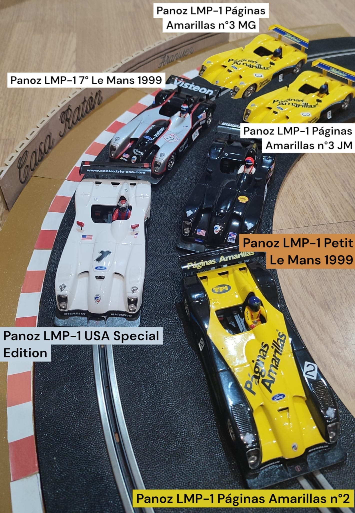
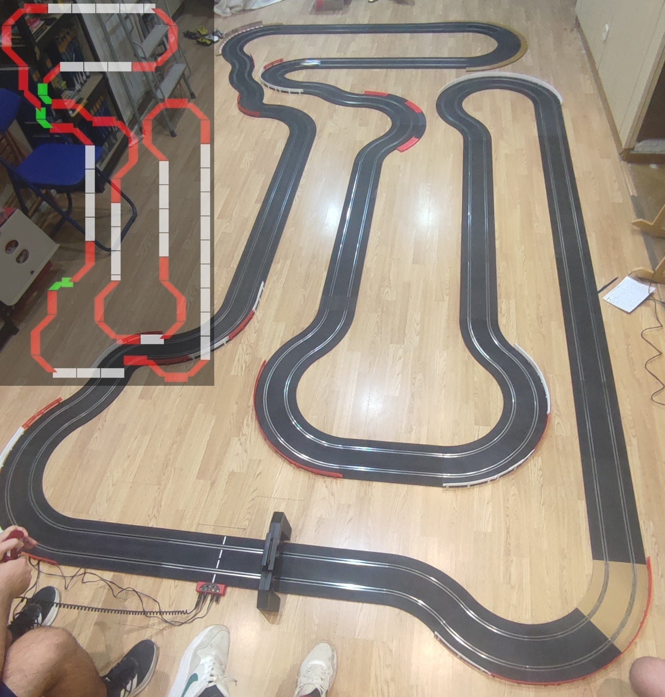

El **Club de Slot Casa Ratón** ha vivido una jornada muy especial con la celebración, por primera vez en el club, de una competición en la categoría **Panoz LMP-1**, una modalidad que ha permitido disfrutar de uno de los prototipos más espectaculares de la marca Fly sobre un circuito especialmente apropiado para este tipo de coches. Todos los pilotos partían con la misma base, el **Panoz Roadster-S**.

La parrilla estuvo formada por cinco auténticas piezas de colección: **PANOZ LMP-1 Páginas Amarillas nº2**, **PANOZ LMP-1 USA Special Edition Mario Andretti**, **PANOZ LMP-1 Petit Le Mans 1999**, **PANOZ LMP-1 7º Le Mans 1999** y **PANOZ LMP-1 Páginas Amarillas nº3**. Cinco decoraciones diferentes para una categoría completamente nueva en el club, pero con un denominador común: unos coches rápidos, temperamentales y que exigieron bastante trabajo a los pilotos.

Y es que el circuito tuvo un protagonismo especial durante la carrera. Se trata de un trazado muy largo y con grandes rectas, unas características que permitieron aprovechar especialmente bien las prestaciones de los Panoz y disfrutar de su velocidad. Sin embargo, tanta velocidad también tenía su precio. Estos coches demostraron tener una marcada tendencia al sobreviraje, haciendo que la parte trasera perdiera adherencia con facilidad y provocando que los Panoz “culearan” muchísimo al entrar o, sobre todo, al salir de las curvas. Había que tener mucho tacto con el gatillo para evitar que el coche acabara fuera del trazado.

Precisamente para adaptarse mejor a las características de esta categoría, la carrera sirvió para estrenar una importante novedad en el Club de Slot Casa Ratón: las vallas y los pianos exteriores. Por primera vez se incorporaron estos elementos al circuito, buscando que los pilotos pudieran aprovechar mejor la velocidad de los coches y, al mismo tiempo, contener las frecuentes salidas provocadas por la pérdida de la trasera. Los pianos exteriores se convirtieron así en un elemento especialmente interesante, permitiendo apurar las curvas y encontrar nuevas formas de sacar partido al trazado sin que cada pequeño exceso terminara irremediablemente con el coche fuera de pista.

En lo puramente deportivo, hubo un claro dominador. El piloto del **PANOZ LMP-1 Páginas Amarillas nº2** consiguió hacerse con la victoria y lo hizo, además, con una ventaja realmente abultada respecto al resto de participantes. Su coche mostró un comportamiento especialmente bueno durante toda la prueba y permitió marcar un ritmo que sus rivales no pudieron seguir. La diferencia fue tal que, en la práctica, la competición terminó convirtiéndose en dos carreras dentro de una: una entre los pilotos que rodaban más rápido y luchaban por las posiciones delanteras, y otra entre aquellos coches que tenían un ritmo inferior y mantenían su propia batalla por detrás.

Como no podía ser de otra manera en una carrera de Slot entre compañeros, la jornada también dejó unas cuantas anécdotas para el recuerdo. Una de ellas tuvo un origen puramente técnico: uno de los coches llevaba las patillas invertidas, provocando pequeños microcortes eléctricos que afectaban a su funcionamiento y que impedían que pudiera correr al ritmo esperado. Una pequeña diferencia aparentemente insignificante, pero que en una competición tan igualada puede acabar teniendo consecuencias importantes.

También hubo lugar para las bromas y los intentos de despistar a los rivales. Entre ellas destacó la supuesta intención de uno de los pilotos de ir a ver “Aquaman 3”, una película que, para desgracia de quienes intentaban utilizarla como estrategia de distracción, ¡ni siquiera existe! Una ocurrencia perfecta para generar alguna duda y sacar alguna sonrisa antes de volver a concentrarse en la carrera.

Pero, sin duda, la anécdota estrella llegó con uno de los Panoz que estaba demostrando un rendimiento especialmente pobre: era **muy lento y además se salía constantemente**. Al mismo tiempo, el coche del ganador estaba funcionando de maravilla. Como ambos modelos eran prácticamente idénticos a simple vista, se decidió realizar un auténtico **“cambiazo”** sin que el resto de pilotos se diera cuenta. Cuando el coche volvió a la pista, la repentina mejoría de rendimiento no pasó desapercibida y provocó la sorpresa general entre los participantes. Un pequeño experimento que demostró, de la forma más divertida posible, que quizá aquel Panoz lento no tenía precisamente un problema de pilotaje...

En definitiva, el debut de los **Panoz LMP-1 en el Club de Slot Casa Ratón** no pudo ser más entretenido. Velocidad, coches difíciles de controlar, nuevas vallas y pianos, una victoria incontestable y un buen puñado de bromas y anécdotas hicieron de esta primera carrera una jornada difícil de olvidar. Ahora queda por ver si estos espectaculares prototipos volverán a la pista para ofrecer una segunda oportunidad de revancha a quienes tuvieron que sufrir el dominio del Páginas Amarillas nº2.

