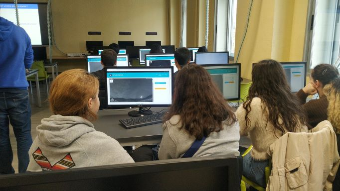
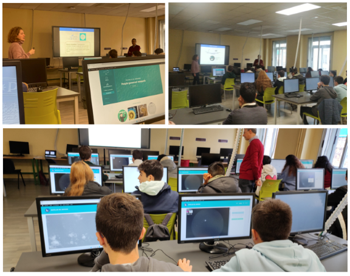

***Con la colaboración de la [Fundación Española para la Ciencia y la Tecnología](https://www.fecyt.es/) - [Ministerio de Ciencia e Innovación](https://www.ciencia.gob.es/)***

El 17 de noviembre presentamos en la ETSIDI la actividad:

**¿Podemos ayudar a los científicos? Conoce qué es la ciencia ciudadana a través del proyecto Destellos del Universo**

Nos visitaron estudiantes de Bachillerato del Colegio San Gabriel de Madrid, quienes conocieron de primera mano lo que es un proyecto de ciencia ciudadana y fueron los primeros en probar nuestro prototipo para colaborar a través del experimento publicado en Zooniverse (aún en fase alfa). Queremos dar las gracias públicamente a los asistentes porque conversamos sobre temas de Astronomía y además nos hicieron un par de sugerencias muy interesantes para nuestra aplicación.

Compartimos algunas fotografías de la jornada.

Enlace a las noticias en nuestras redes sociales: Instagram, Facebook y Twitter.

Twitter: [*@cslabupm*](https://twitter.com/cslabupm)

Instagram: [*@cslabupm*](https://www.instagram.com/cslabupm/)

Facebook: [*@cslab-upm*](https://www.facebook.com/cslabupm/)

