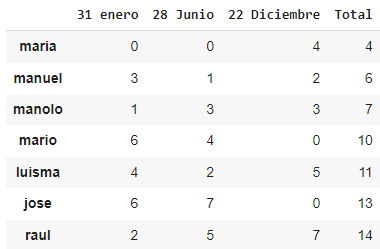

#Clasificación 2024

Los siguientes resultados corresponden a los torneos realizados durante 2024. Todas las carreras se han corrido sin imán para incrementar la dificultad de la carrera.

El sistema de puntos es parecido al que se usa en la competición de F1. De esta forma, el vencedor recibirá 7 puntos, el segundo 5 puntos, tercero 4 puntos... así sucesivamente hasta el sexto que recibe solo 1 punto. A partir de este, no se reciben puntos.

Para incentivar la pasión por la mecánica y la electrónica, también se premiará al piloto que tenga su vehículo mejor preparado. Por lo tanto, también habrá un Mundial de mecánicos. Se otorgarán 2 puntos si el piloto no toca su vehículo durante la competición, 1 punto si hace pequeñas modificaciones y 0 puntos si el vehículo directamente tiene que pasar por taller. No se contará como modificación retirar el imán del coche.

Obviamente estas competiciones son de carácter amistosa y no se busca la disputa entre participantes.

El vencedor al final de año recibirá una palmadita en la espalda y el perdedor el aclamado "premio patata".
