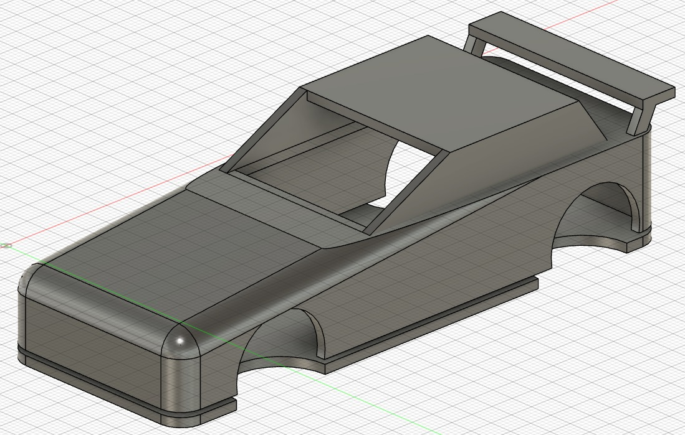

[Semaforo/Cuentavueltas con Arduino](https://rchamo01.github.io/CasaRatonScalextric/diy/01-semaforo)

[Construcción coche desde 0](https://rchamo01.github.io/CasaRatonScalextric/diy/03-cochedesde0)

[Código para la clasificación](https://rchamo01.github.io/CasaRatonScalextric/diy/02-codigoclasificacion)

[Código enfrentamientos](https://rchamo01.github.io/CasaRatonScalextric/diy/04-codigoenfrentamientos)

