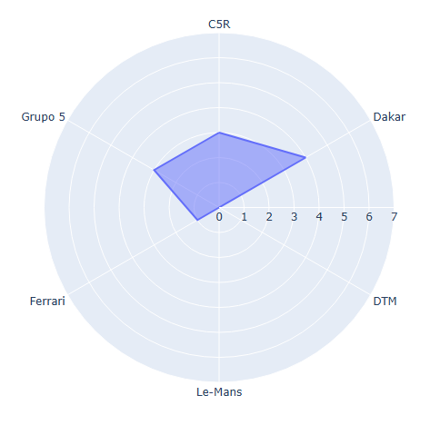
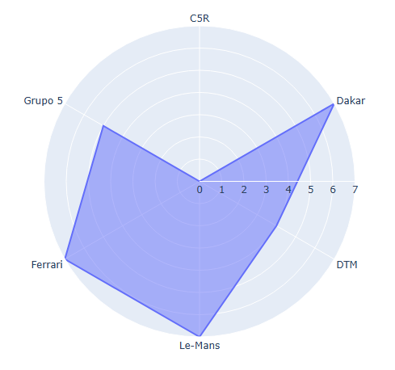
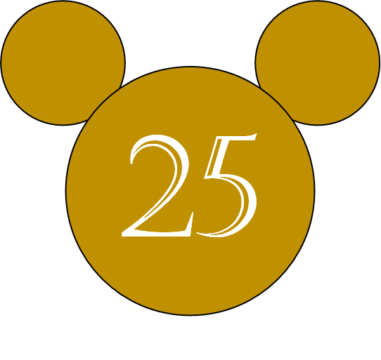
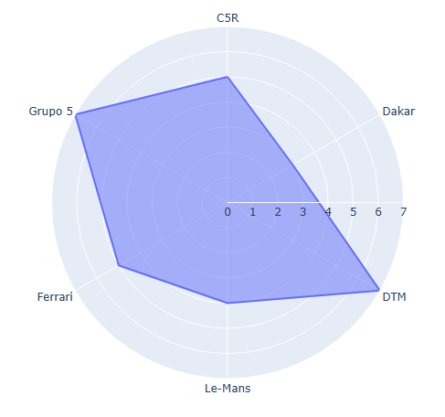
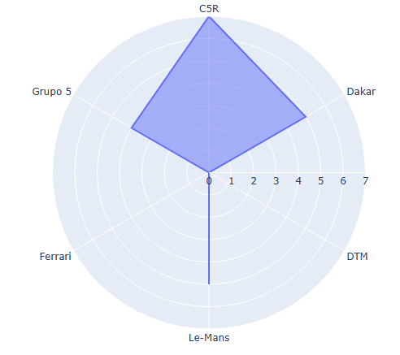
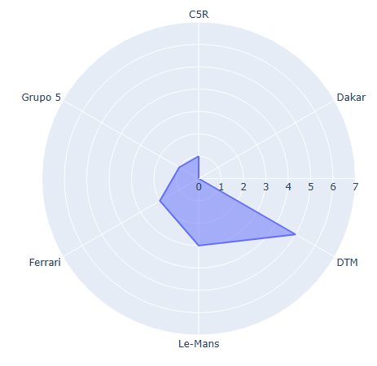
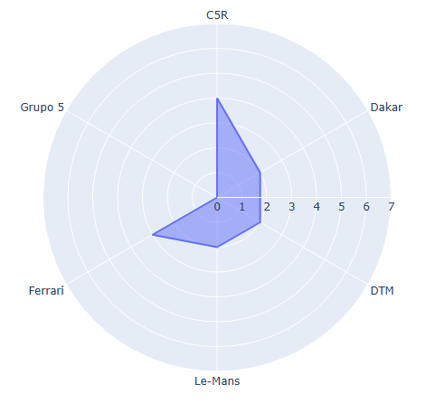

El club de Slot está formado por los siguientes integrantes:

# T Manolo 

 

Descripción Manolo

# Luis Manuel

 

Descripción Luisma

# Jose Manuel

 

Jose M. se sienta frente a su pista de Slot con una mirada decidida, el pulso firme y una confianza que no se ve en muchos. Su estilo de juego es audaz, siempre dispuesto a tomar curvas a la máxima velocidad, desafiando las leyes de la física y las expectativas de los demás. A pesar de las pequeñas derrapadas y choques, nunca se detiene. En lugar de frenarse, ajusta su enfoque, corrige al vuelo y vuelve a acelerar, demostrando que su valentía no está en evitar los errores, sino en aprender de ellos para ir aún más rápido.

A veces, las manos tiemblan un poco al intentar tomar una curva cerrada, pero su rostro sigue serio, sin duda, sin temor. Cada carrera es un desafío personal, una oportunidad para probar hasta dónde puede llegar, para romper límites y demostrar que la valentía no es solo para los momentos épicos, sino para cada decisión que tomas en el camino. A menudo, otros lo ven como un loco, pero para él, es solo una manera de vivir: arriesgarse, aprender y seguir jugando.

 

# Raúl 

 

<!-- Esto no será visible. -->
 

Es un piloto con una habilidad y precisión notable. Tiene un control del coche, manteniendo la velocidad adecuada en cada tramo del circuito. Su precisión en la aceleración y el frenado es clave, lo que permite mantener el coche dentro de la pista incluso en las secciones más desafiantes.

Además, este piloto tiene un profundo conocimiento de las características de su coche, optimizando la configuración del vehículo para cada pista. Es famoso por sus mejoras en el coche, como por ejemplo, cuando añadió peso en su f1 para mejorar la adherencia y aprovechar al máximo la potencia del motor.

Es posible que este jugador disfrute tanto del aspecto técnico como del competitivo del juego, dedicando tiempo a la puesta a punto del coche.

Por último, la constancia y experiencia acumulada a lo largo de muchas partidas le dan una ventaja, permitiéndole anticipar situaciones y reaccionar con rapidez y eficacia. Este tipo de jugador no solo disfruta de la competición, sino que también puede compartir su pasión y conocimientos con otros del club.

 

# Mario

 

Descripción Mario

# Maria

 

Descripción Maria

# Manuel

 

Manuel es un piloto de Scalextric humilde, de los que entienden la competición como una cuestión de valores y no solo de resultados. En la pista destaca por su constancia, su respeto y su forma honesta de competir. Se identifica plenamente con el espíritu del Rayo Vallecano: barrio, lucha y corazón por encima de los grandes medios. Manuel cree en el trabajo silencioso, en mejorar curva a curva y en no rendirse nunca, aunque el rival tenga más nombre o mejores recursos. Para él, correr es una forma de demostrar que la humildad y el esfuerzo siempre van por delante del postureo.

 

# Maria GM *

Descripción Maria GM
