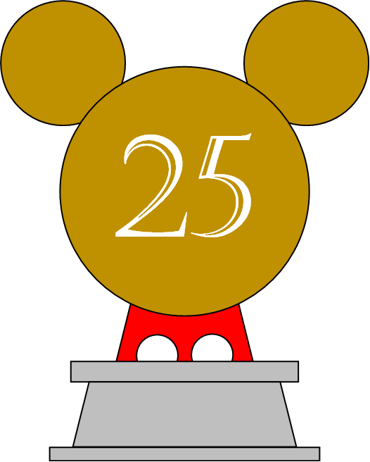
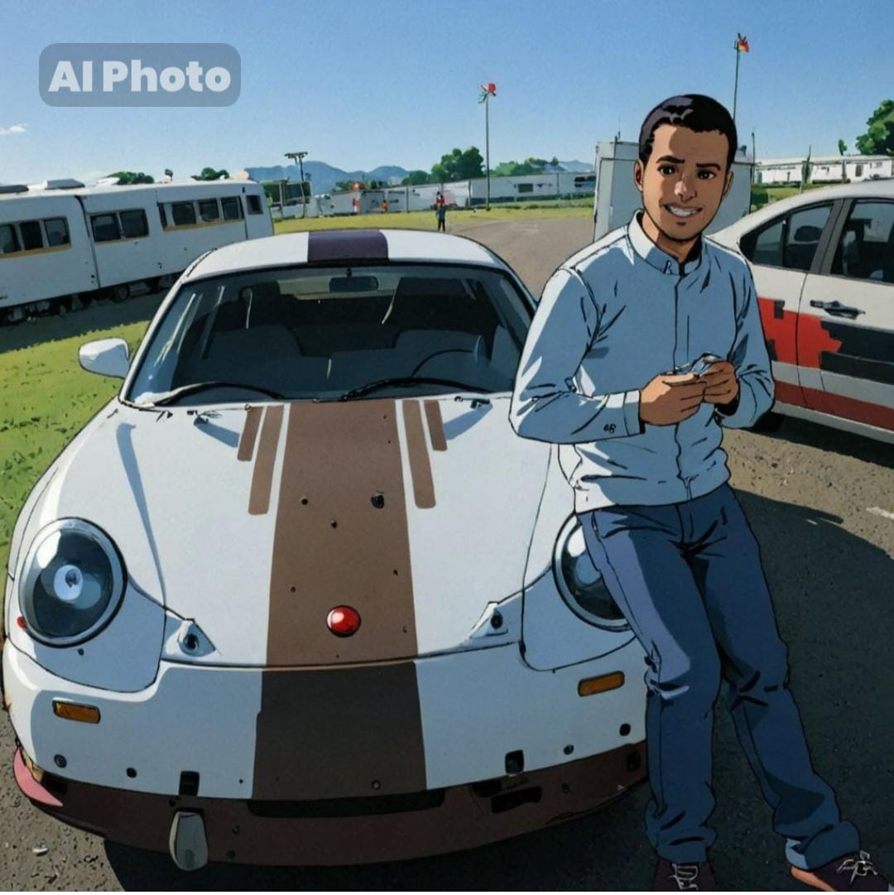

El club de Slot está formado por los siguientes integrantes:

# T Manolo 

Descripción Manolo

# Luis Manuel

Descripción Luisma

# Jose Manuel

Descripción Jose Manuel

#  Raúl 

Es un piloto con una habilidad y precisión notable. Tiene un control del coche, manteniendo la velocidad adecuada en cada tramo del circuito. Su precisión en la aceleración y el frenado es clave, lo que permite mantener el coche dentro de la pista incluso en las secciones más desafiantes.

Además, este piloto tiene un profundo conocimiento de las características de su coche, optimizando la configuración del vehículo para cada pista. Es famoso por sus mejoras en el coche, como por ejemplo, cuando añadió peso en su f1 para mejorar la adherencia y aprovechar al máximo la potencia del motor.

Es posible que este jugador disfrute tanto del aspecto técnico como del competitivo del juego, dedicando tiempo a la puesta a punto del coche.

Por último, la constancia y experiencia acumulada a lo largo de muchas partidas le dan una ventaja, permitiéndole anticipar situaciones y reaccionar con rapidez y eficacia. Este tipo de jugador no solo disfruta de la competición, sino que también puede compartir su pasión y conocimientos con otros del club.

# Mario

Descripción Mario

# Maria

Descripción Maria

# Manuel

Descipción Manuel
