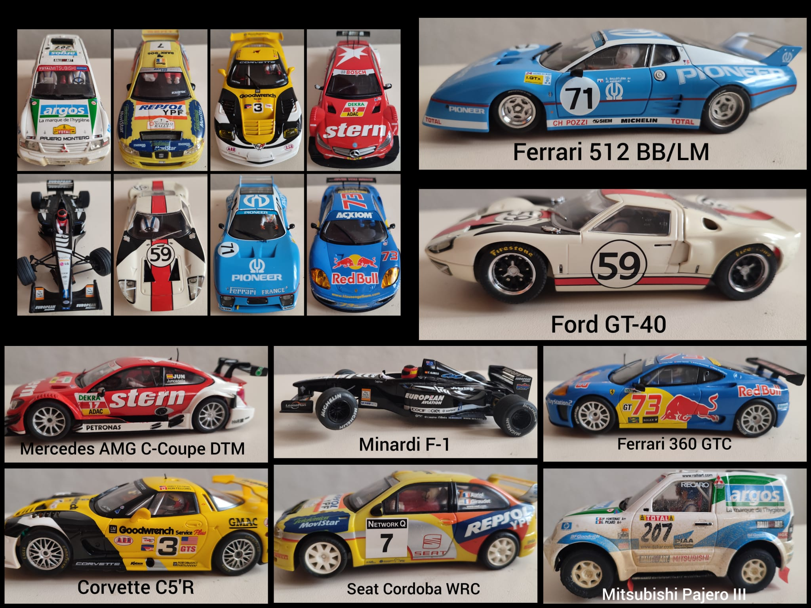
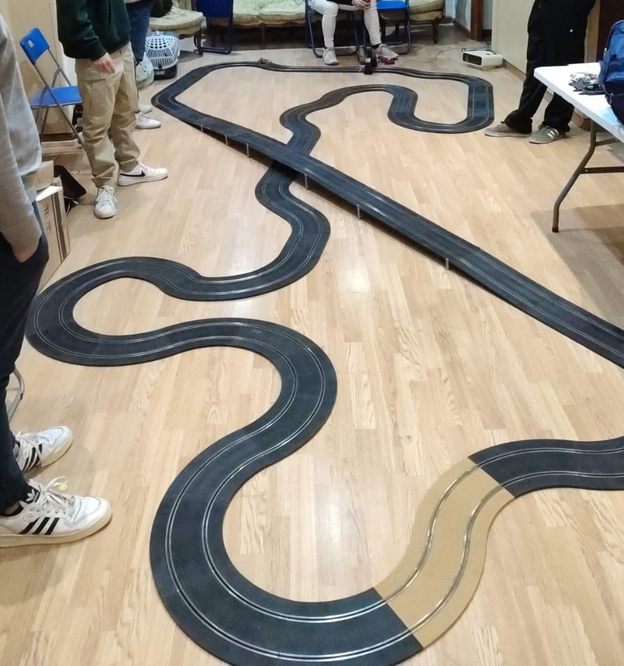

El club Casa Ratón Scalextric es un espacio vibrante y acogedor donde la familia se reúnen para disfrutar de la emoción del modelismo en competiciones amigables. Este club destaca por su diversidad en cuanto a los tipos de coches de competición que se utilizan, abarcando desde coches de rally hasta los clásicos de Le Mans, pasando por modelos f1 y GT. 

La atmósfera del club es de camaradería y diversión, donde la competición se vive de una manera muy sana y constructiva. Las carreras aquí no solo se centran en la victoria, sino en el disfrute y el aprendizaje compartido entre padres, hijos y primos. Los circuitos pueden ser adaptados para incluir tramos de rally con curvas cerradas y superficies variadas, largos recorridos de resistencia al estilo Le Mans, o pistas técnicas que prueban la habilidad de los pilotos con dunas o chicanes.

Una de las tradiciones más destacadas del club es el "premio patata", un reconocimiento humorístico y simbólico que se otorga al perdedor de cada competición. Este premio tiene su origen en las primeras competiciones cuando algunos coches no funcionaban o eran demasiado lentos. Alguien sugirió que una patata seria más rápida.

El club ofrece un ambiente donde los más pequeños pueden aprender de los mayores, desarrollando no solo habilidades de conducción, sino también valores como la paciencia, la estrategia, y el trabajo en equipo. Además, las reuniones suelen incluir momentos de socialización, donde se comparten trucos de preparación de los coches, consejos sobre las mejores configuraciones y, sobre todo, se fomenta un sentido de comunidad. 

Este club de Scalextric no es solo un lugar para competir; es un espacio donde se crean recuerdos familiares, se fortalecen lazos y se comparte una pasión por el automodelismo que trasciende generaciones.
