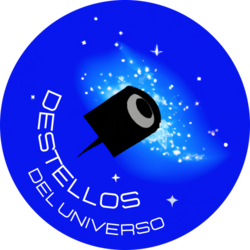
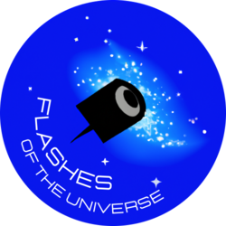
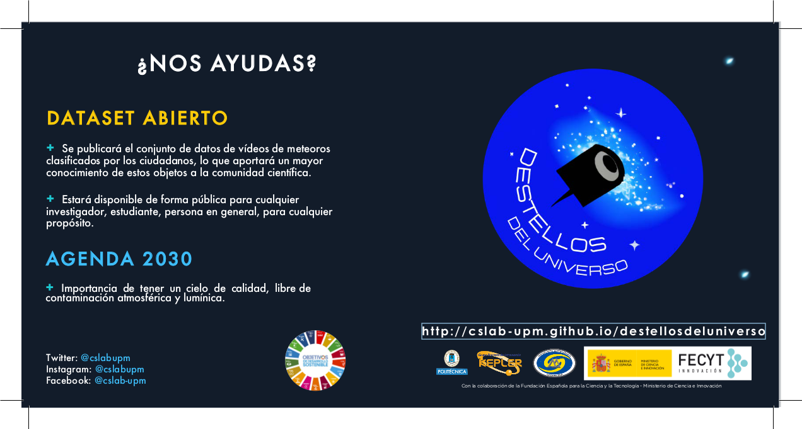
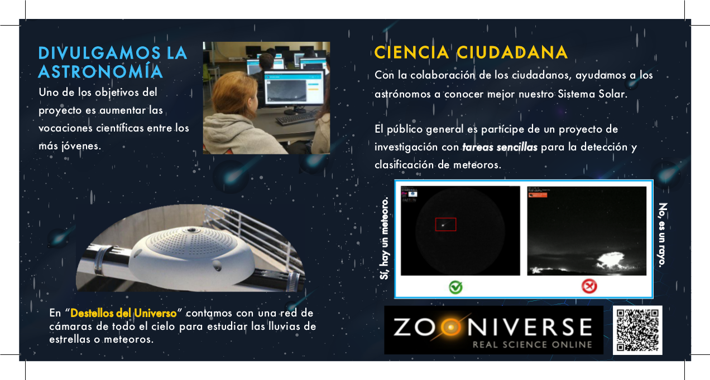
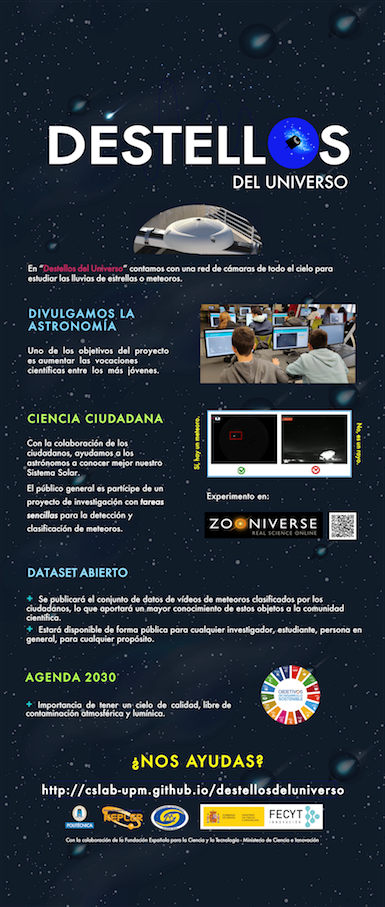
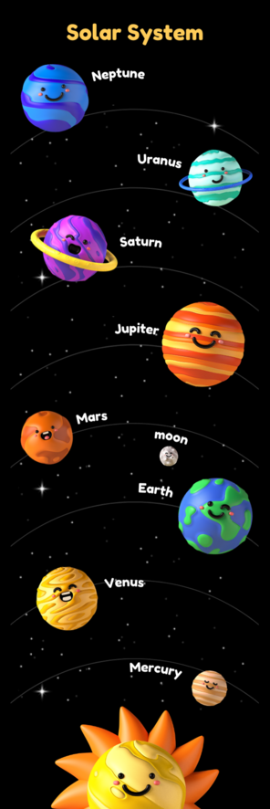
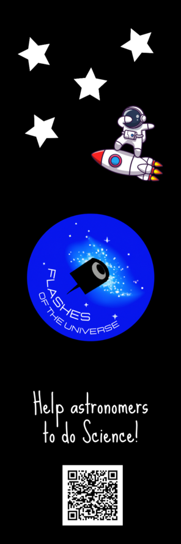

## Unidades Didácticas

El Aula de Astronomía de Fuenlabrada ha elaborado la siguiente unidad didáctica para trabajar con cursos de primaria sobre el sistema solar y, más concretamente, los meteoros. Está disponible para cualquier docente que quiera realizar un taller sobre este campo:

+ [Unidad didáctica: Cazando meteoros](../docs/images/UNIDAD_DIDACTICA_PARA_PRIMARIA_METEOROS_1.pdf) (PDF, 3 páginas). Autores: Aula de Astronomía de Fuenlabrada.

Nuestro colaborador, el **Instituto de Astrofísica de Canarias**, también tiene una colección de unidades didácticas sobre Astronomía. Se enlazan las más relacionadas con este proyecto:

+ [Unidad didáctica: Lluvia de estrellas](https://www.iac.es/es/divulgacion/ediciones/lluvia-de-estrellas-unidad-didactica)(PDF, 114 páginas). Autores: Luis Bellot, David Martínez, Miquel Serra-Ricart y Emilio Pérez. 

Se trata de una unidad didáctica dirigida a profesores de Taller de Astronomía y Ciencias Naturales de ESO y Bachillerato con el objetivo de introducir a los estudiantes en el campo de la investigación científica a través de la observación de las lluvias de meteoros a lo largo del año.

+ [Unidad didáctica: El cielo nocturno. Hemisferio Norte Verano](https://www.iac.es/cosmoeduca/enlaces/cielos.pdf) (PDF, 69 páginas). Autores: Juan Carlos Casado, Miquel Serra-Ricart y Cristina Abajas Bustillo. 

## Material de difusión

+ Logo

||| |

+ [Folleto díptico sobre el proyecto](../docs/images/diptico_destellos.pdf) (6.2 MB PDF)

+ [Roll-up sobre el proyecto](../docs/images/roll_up_destellos.pdf) (34.2 MB PDF)

+ Marcapáginas

|||

